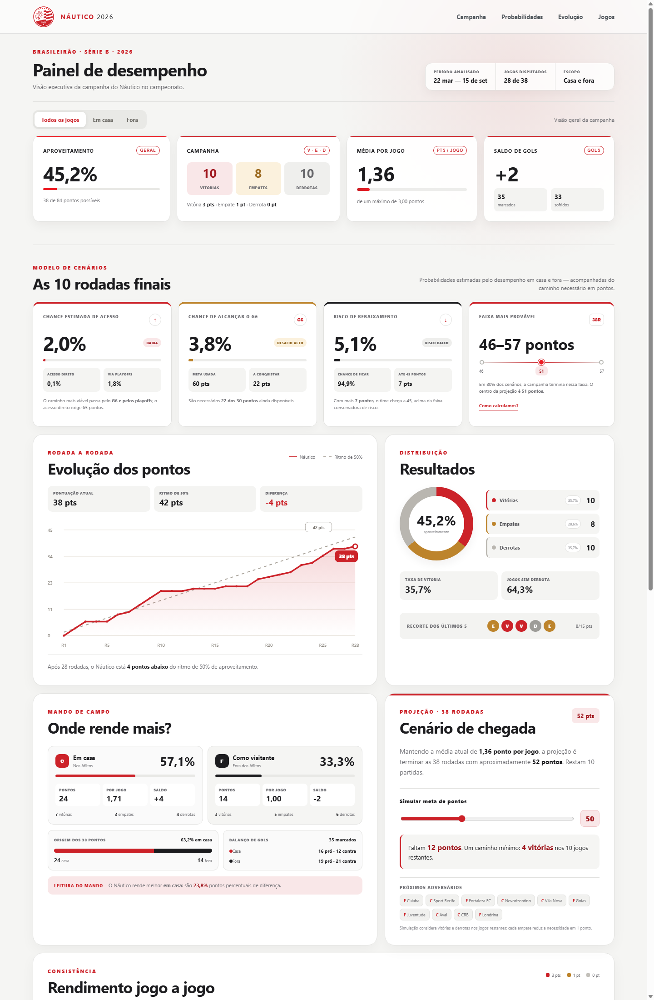

  

<h1 align="center">Dashboard Gerencial — Náutico na Série B 2026</h1>

  Projeto de análise de dados esportivos que transforma os resultados da campanha do Náutico em indicadores de desempenho, tendências e cenários probabilísticos.

  
  
  
  

## Sobre o projeto

Esta dashboard foi desenvolvida para acompanhar a campanha do Clube Náutico Capibaribe na Série B de 2026 sob uma perspectiva gerencial. O painel consolida os resultados jogo a jogo, compara o desempenho dentro e fora de casa e converte a campanha em informações úteis para tomada de decisão.

Além dos indicadores tradicionais, o projeto apresenta projeções para as rodadas finais e um modelo probabilístico para estimar as chances de acesso, chegada ao G6 e rebaixamento.

## Panorama analisado

| Indicador | Resultado |
|---|---:|
| Jogos disputados | 28 |
| Pontos conquistados | 38 |
| Campanha | 10 vitórias, 8 empates e 10 derrotas |
| Aproveitamento | 45,2% |
| Média de pontos | 1,36 por jogo |
| Gols | 35 marcados e 33 sofridos |
| Saldo de gols | +2 |

Os dados representam o recorte disponível até 15 de setembro de 2026.

## Principais insights

- O Náutico apresenta melhor rendimento como mandante: **57,1% de aproveitamento**, contra **33,3% como visitante**.
- Dos 38 pontos conquistados, **24 foram obtidos em casa** e **14 fora de casa**.
- O saldo muda de **−8 no primeiro tempo** para **+10 no segundo**; 71,4% dos gols da equipe foram marcados após o intervalo.
- Após 28 rodadas, a equipe está **4 pontos abaixo** do ritmo equivalente a 50% de aproveitamento.
- Mantida a média de 1,36 ponto por jogo, a projeção é encerrar a competição com aproximadamente **52 pontos**.
- O intervalo mais provável do modelo concentra 80% dos cenários entre **46 e 57 pontos**, com mediana de **51 pontos**.
- As probabilidades estimadas no recorte atual são **2,0% de acesso**, **3,8% de chegada ao G6** e **5,1% de rebaixamento**.

## O que a dashboard entrega

- KPIs de pontos, aproveitamento, média por jogo e saldo de gols;
- distribuição de vitórias, empates e derrotas;
- evolução da pontuação rodada a rodada;
- comparação entre desempenho em casa e como visitante;
- comparação de gols marcados e sofridos no primeiro e no segundo tempo;
- rendimento por períodos da competição;
- sequência recente e indicadores de consistência;
- projeção de pontuação para as 38 rodadas;
- simulação de metas de pontos;
- cenários probabilísticos de acesso, G6 e rebaixamento;
- análise dos próximos adversários com retrospecto do primeiro turno;
- tabela completa com busca por adversário e filtros por mando de campo.

## Metodologia

### Pontuação e aproveitamento

- Vitória: 3 pontos;
- empate: 1 ponto;
- derrota: 0 ponto;
- aproveitamento: pontos conquistados ÷ pontos possíveis.

O painel considera somente partidas com <code>status</code> igual a <code>finished</code> e resultado identificado como <code>V</code>, <code>E</code> ou <code>D</code>.

### Modelo probabilístico

As probabilidades são calculadas por uma distribuição preditiva bayesiana com prior de Jeffreys, separando o desempenho como mandante e visitante. Os jogos restantes são identificados pelo espelhamento da tabela do primeiro turno.

Referências adotadas no modelo:

- G6: 60 pontos ou mais;
- acesso direto: 65 pontos ou mais;
- acesso via playoffs: 50% da probabilidade de terminar entre 60 e 64 pontos;
- rebaixamento: 44 pontos ou menos.

Essas faixas são referências analíticas e não representam cortes garantidos. O modelo não considera a campanha dos demais clubes, critérios de desempate ou a força individual dos adversários.

## Tecnologias utilizadas

- **Python:** coleta e preparação dos dados;
- **Streamlit:** publicação e disponibilização da aplicação;
- **JavaScript:** cálculos, filtros, simulações e renderização dos gráficos;
- **HTML e CSS:** estrutura, responsividade e identidade visual;
- **CSV:** armazenamento da base consolidada;
- **GitHub:** versionamento e integração com o deploy.

## Estrutura do projeto

<pre><code>analise_nautico/
├── app.js
├── coleta_detalhada.py
├── dashboard-preview.png
├── index.html
├── nautico-logo.svg
├── nautico_serie_b_2026_todos_jogos.csv
├── requirements.txt
├── server.js
├── streamlit_app.py
└── styles.css
</code></pre>

## Executar localmente

### Streamlit

<pre><code>git clone https://github.com/pablohmelo02/analise_nautico.git
cd analise_nautico
python -m pip install -r requirements.txt
python -m streamlit run streamlit_app.py
</code></pre>

A aplicação será disponibilizada normalmente em <code>http://localhost:8501</code>.

### Versão HTML

<pre><code>node server.js
</code></pre>

Depois, acesse <code>http://localhost:8000</code>.

## Atualização dos dados

O arquivo <code>coleta_detalhada.py</code> concentra a rotina de coleta, incluindo os placares do primeiro e do segundo tempo, enquanto <code>nautico_serie_b_2026_todos_jogos.csv</code> funciona como base consolidada da dashboard.

Antes de executar a coleta, informe a chave da API por variável de ambiente no PowerShell:

<pre><code>$env:FSAPI_KEY="SUA_CHAVE"
python coleta_detalhada.py
</code></pre>

A chave não deve ser gravada no código nem enviada ao GitHub. Após atualizar o CSV e enviar um novo commit para a branch <code>main</code>, o Streamlit Community Cloud realiza o redeploy da aplicação.

## Competências demonstradas

- coleta e tratamento de dados via API;
- definição e cálculo de indicadores esportivos;
- análise exploratória e comunicação de insights;
- modelagem probabilística de cenários;
- construção de dashboards responsivos;
- versionamento com Git e publicação em nuvem.

---

Desenvolvido por [Pablo Melo](https://github.com/pablohmelo02).